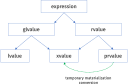

# Semantyka przenoszenia

## Motywacje dla semantyki przenoszenia

- Optymalizacja wydajności:
  - możliwość rozpoznania kiedy mamy do czynienia z obiektem tymczasowym (*temporary object*)
  - możliwość wskazania, że obiekt nie będzie dalej używany - jego czas życia wygasa (*expiring object*)
- Możliwość implementacji obiektów, które nie mogą być kopiowane, ale umożliwiają transfer prawa własności do zasobu:
  - `auto_ptr<T>` w C++98 symulował semantykę przenoszenia za pomocą konstruktora kopiującego i operatora przypisania
  - obiekty kontrolujące zasoby systemowe, które nie mogą być łatwo kopiowane - wątki, pliki, strumienie, itp.

Przykład (potencjalnie) nieefektywnego kodu w C++98:

```c++
void create_and_insert(std::vector<string>& coll)
{
    std::string str = "text";

    coll.push_back(str); // insert a copy of str
                         // str is used later

    coll.push_back(str + str); // insert a copy of temporary value
                               // unnecessary copy in C++98

    coll.push_back("text"); // insert a copy of temporary value
                            // unnecessary copy in C++98

    coll.push_back(str);  // insert a copy of str
                          // unnecessary copy in C++98

    // str is no longer used
}
```

## lvalue i rvalue

Aby umożliwić implementację semantyki przenoszenia C++11 wykorzystuje podział obiektów na:

- **lvalue**
  - obiekt posiada nazwę
  - można pobrać adres obiektu
- **rvalue**
  - nie można pobrać adresu
  - zwykle nienazwany obiekt tymczasowy (np. obiekt zwrócony z funkcji)
  - z obiektów rvalue możemy transferować stan pozostawiając je w poprawnym, ale nieokreślonym stanie

Przykłady:

```c++
double dx;
double* ptr; // dx and ptr are lvalues

std::string foo(std::string str); // foo and str are lvalues

// foo's return is rvalue
foo("Hello"); // temp string created for call is rvalue

std::vector<int> vec; // vec is lvalue

vec[5] = 0; // vec[5] is lvalue
```

Operacja przenoszenia, która wiąże się ze zmianą stanu jest niebezpieczna dla obiektów lvalue ponieważ obiekt może zostać użyty po wykonaniu takiej operacji.

Operacje przenoszenia są bezpieczne dla obiektów rvalue.

## Referencje rvalue - *rvalue references*

C++11 wprowadza referencje do rvalue - **rvalue references**, które zachowują się podobnie jak klasyczne referencje z C++98 (zwane w C++11 **lvalue references**).

- składnia: `T&&`
- muszą zostać zainicjowane i nie mogą zmienić odniesienia
- służą do identyfikacji operacji, które implementują przenoszenie

### Reguły wiązania referencji

Wprowadzenie referencji do rvalue rozszerza reguły wiązania referencji:

- Tak jak w C++98:
  - **lvalues** mogą być wiązane do **lvalue references**

    ```c++
    int x = 10;
    int& ref_x = x; // OK
    ```

  - **rvalues** mogą być wiązane do **const lvalue references**

    ```c++
    std::string get_name();
    const std::string& name = get_name(); // OK
    std::string& invalid = get_name(); // Error
    ```

- W C++11:
  - **rvalues** mogą być wiązane do **rvalue references**

    ```c++
    std::string&& name = get_name();
    ```

  - **lvalues** nie mogą być wiązane do **rvalue references**

    ```c++
    int&& rv_ref = x; // Error - x is lvalue
    ```

```{important}
Stałe obiekty lvalue lub rvalue mogą być wiązane tylko z referencjami do const (`const T&&` są poprawne składniowo, ale nie mają sensu).
```

## Implementacja semantyki przenoszenia

Używając **rvalue references** możemy zaimplementować semantykę przenoszenia. Przykładem może być klasa `std::vector<T>`, która przeciąża operację `push_back()` na dwa sposoby:

```c++
template <typename T>
class vector
{
public:
    void push_back(const T& item);  // inserts a copy of item

    void push_back(T&& item); // moves item into container
};
```

Dla tak zdefiniowanej klasy kompilator uniknie tworzenia niepotrzebnych kopii dla obiektów, które mogą zostać przeniesione:

```c++
void create_and_insert(std::vector<string>& coll)
{
    string str = "text";

    coll.push_back(str); // insert a copy of str
    // str is used later

    coll.push_back(str + str); // rvalue binds to push_back(string&&)
                               // temp is moved into container

    coll.push_back("text"); // rvalue binds to push_back(string&&)
                            // tries to move temporary object into container

    coll.push_back(std::move(str));  // tries to move str object into container

    // str is no longer used
}
```

Innym przykładem mało wydajnej implementacji z wykorzystaniem kopiowania jest implementacja `swap()` w C++98:

```c++
template <typename T>
void swap(T& a, T& b)
{
    T temp = a;  // copy a to temp
    a = b; // copy b to a
    b = temp; // copy temp to b
} // destroy temp
```

Funkcja `std::swap()` może zostać wydajniej zaimplementowana w C++11 z wykorzystaniem semantyki przenoszenia - zamiast kopiować przenosimy wewnętrzny stan obiektów (np. wskaźniki do zasobów):

```c++
#include <utility>

template <typename T>
void swap(T& a, T& b)
{
    T temp {std::move(a)};  // tries to move a to temp
    a = std::move(b); // tries to move b to a
    b = std::move(temp); // tries to move temp to b
} // destroy temp
```

## Semantyka przenoszenia w klasach

Aby zaimplementować semantykę przenoszenia dla klasy należy zapewnić jej:

- konstruktor przenoszący - przyjmujący jako argument **rvalue reference**
- przenoszący operator przypisania - przyjmujący jako argument **rvalue reference**

```{important}
Konstruktor przenoszący i przenoszący operator przypisania są nowymi specjalnymi funkcjami składowymi klas w C++11.
```

### Funkcje specjalne klas w C++11

W C++11 istnieje sześć specjalnych funkcji składowych klasy:

- konstruktor domyślny - `X();`
- destruktor - `~X();`
- konstruktor kopiujący - `X(const X&);`
- kopiujący operator przypisania - `X& operator=(const X&);`
- konstruktor przenoszący - `X(X&&);`
- przenoszący operator przypisania - `X& operator=(X&&);`

Specjalne funkcje mogą być:

- nie zadeklarowane - **not declared**
- niejawnie zadeklarowane - **implicitly declared**
- zadeklarowane przez użytkownika - **user declared**

Specjalne funkcje zdefiniowane jako `= default` są traktowane jako **user declared**.

Kiedy destruktor oraz operacje kopiowania nie są zadeklarowane przez użytkownika (*user declared*), to klasy domyślnie implementują semantykę przenoszenia.

- domyślny konstruktor przenoszący przenosi każdą składową klasy.
- domyślny przenoszący operator przypisania deleguje semantykę przenoszenia do każdej składowej klasy

Konceptualny kod domyślnego konstruktora przenoszącego i przenoszącego operatora przypisania:

```c++
class X : public Base
{
    Member m_;

    X(X&& x) : Base(static_cast<Base&&>(x)), m_(static_cast<Member&&>(x.m_))
    {}

    X& operator=(X&& )
    {
        Base::operator=(static_cast<Base&&>(x));
        m_ = static_cast<X&&>(x.m_);

        return *this;
    }
};
```

Przenoszące funkcje specjalne implementowane przez użytkownika:

```c++
class X : public Base
{
    Member m_;

    X(X&& x) : Base(std::move(x)), m_(std::move(x.m_))
    {
        x.set_to_resourceless_state();
    }

    X& operator=(X&& )
    {
        Base::operator=(std::move(x));
        m_ = std::move(x.m_);
        x.set_to_resourceless_state();

        return *this;
    }
};
```

Jeśli klasa nie zapewnia prawidłowej semantyki przenoszenia - w rezultacie wykonania operacji `std::move()` odbywa się kopiowanie.

### Reguła =default

Jeżeli jedna z poniższych funkcji specjalnych klasy jest **user declared**

- konstruktor kopiujący
- kopiujący operator przypisania
- destruktor
- jedna z przenoszących funkcji specjalnych

specjalne funkcje przenoszące nie są generowane przez kompilator i operacja przenoszenia jest implementowana poprzez kopiowanie elementu (*fallback to copy*).

Klasa:

```c++
struct Gadget // default copy and move semantics enabled
{
    int id;
    std::string name;
};
```

nie jest równoważna klasie:

```c++
struct Gadget // default move semantics disabled - type is only copyable
{
    int id;
    std::string name;

    ~Gadget() 
    {
        //...
    };
};
```

Aby umożliwić efektywne przenoszenie składowych obiektów należy zdefiniować (najlepiej) wszystkie funkcje specjalne.

```{important}
Jeśli choć jedna specjalna funkcja składowa jest `= delete`, należy zdefiniować je wszystkie!
```

### Reguła "Rule of Five"

Jeśli w klasie jest konieczna implementacja jednej z poniższych specjalnych funkcji składowych:

- konstruktora kopiującego
- konstruktora przenoszącego
- kopiującego operatora przypisania
- przenoszącego operatora przypisania
- destruktora

najprawdopodobniej **należy zaimplementować wszystkie**.

Ta regułą stosuje się również do funkcji specjalnych zdefiniowanych jako `default`.

```c++
struct Gadget // default move semantics disabled - type is only copyable
{
    int id;
    std::string name;

    Gadget(const Gadget&) = default;
    Gadget& operator=(const Gadget&) = default;
    Gadget(Gadget&&) = default;
    Gadget& operator=(Gadget&&) = default;
    ~Gadget() 
    {
        // ...
    }
};
```

## Implementacja funkcji std::move()

Implementacja funkcji `std::move(obj)` dokonuje rzutowania na **rvalue reference** - jest to w praktyce `static_cast<T&&>(obj)`.

```c++
template <typename T>
typename std::remove_reference<T>::type&& move(T&& obj) noexcept
{
    using ReturnType = std::remove_reference<T>::type&&;
    return static_cast<ReturnType>(obj);
}
```

## Reference collapsing

W procesie tworzenia instancji szablonu następuje często zwijanie referencji (tzw. **reference collapsing**)

Jeśli mamy szablon:

```c++
template <typename T>
void f(T& item)
{
    // ...
}
```

Jeśli przekażemy jako parametr szablonu `int&`, to tworzona początkowo instancja szablonu wygląda następująco:

```c++
void f(int& & item);
```

Reguła zwijania referencji powoduje, że `int& &` -\> `int&`. W rezultacie instancja szablonu wygląda tak:

```c++
void f(int& obj);
```

W C++11 obowiązują następujące reguły **reference collapsing**

| Składnia |       | Efekt |
| :------: | :---: | :---: |
|  `T& &`  | `->`  | `T&`  |
| `T&& &`  | `->`  | `T&`  |
| `T& &&`  | `->`  | `T&`  |
| `T&& &&` | `->`  | `T&&` |

### Mechanizm dedukcji typów w szablonach

Dla szablonu

```c++
template <typename T>
void f(T&&)  // non-const rvalue reference
{
    // ...
}
```

typ `T` jest dedukowany w zależności od tego co zostanie przekazane jako argument wywołania funkcji:

- jeśli przekazany zostanie obiekt *lvalue* - to parametr szablonu jest referencją lvalue - T&
- jeśli przekazany zostanie obiekt *rvalue* - to parametr szablonu nie jest referencją - T

W połączeniu z regułami zwijania referencji dostajemy w rezultacie:

```c++
string str;

f(str);  // lvalue : f<string&>(string& &&) - > f<string&>(string&)

f(string("Hello")); // rvalue : f<string>(string&&)
```

## Forwarding reference

Referencja rvalue `T&&` użyta jako parametr funkcji szablonowej ma szczególne zastosowanie:

- dla argumentów l-value `T&&` kolapsuje do `T&` i wiąże się z wartościami lvalue
- dla argumentów r-value `T&&` pozostaje `T&&` - wiąże się z wartościami rvalue

Ponieważ mechanizm dedukcji typów w `auto` jest taki sam jak w szablonach:

```c++
std::string get_line(std::istream& in);
auto&& line = get_line(std::cin);  // type of line: std::string&&

std::string name = "Ola";
auto&& alias = name; // type of alias: std::string&
```

## Perfect Forwarding

Przeciążanie funkcji w celu optymalizacji wydajności z wykorzystaniem semantyki przenoszenia i referencji rvalue może prowadzić do nadmiernego rozrostu interfejsów:

```c++
class Gadget;

void have_fun(const Gadget&);
void have_fun(Gadget&); // copy semantics
void have_fun(Gadget&&); // move semantics

void use(const Gadget& g)
{
    have_fun(g); // calls have_fun(const Gadget&)
}

void use(Gadget& g)
{
    have_fun(g); // calls have_fun(Gadget&)
}

void use(Gadget&& g)
{
    have_fun(std::move(g)); // calls have_fun(Gadget&&)
}

int main()
{
    const Gadget cg;
    Gadget g;

    use(cg);  // calls use(const Gadget&) then calls have_fun(const Gadget&)
    use(g);   // calls use(Gadget&) then calls have_fun(Gadget&)
    use(Gadget()); // calls use(Gadget&&) then calls have_fun(Gadget&&)
}
```

Rozwiązaniem jest szablonowa funkcja przyjmująca jako parametr wywołania `T&&` (**forwarding reference**) i przekazująca argument do następnej funkcji z wykorzystaniem funkcji `std::forward<T>()`.

```c++
class Gadget;

void have_fun(const Gadget&);
void have_fun(Gadget&); // copy semantics
void have_fun(Gadget&&); // move semantics

template <typename Gadget>
void use(Gadget&& g)
{
    have_fun(std::forward<Gadget>(g)); // forwards original type to have_fun()
                                       // - rvalue reference if T is Gadget
                                       //   without forward<> only have_fun(const Gadget&)
                                       //   and have_fun(Gadget&) would get called
}

int main()
{
    const Gadget cg;
    Gadget g;

    use(cg);  // calls use(const Gadget&) then calls have_fun(const Gadget&)
    use(g);   // calls use(Gadget&) then calls have_fun(Gadget&)
    use(Gadget()); // calls use(Gadget&&) then calls have_fun(Gadget&&)
}
```

Funkcja `std::forward<T>()` działa jak warunkowe rzutowanie na `T&&`, gdy dedukowanym parametrem szablonu jest typ nie będący referencją.

## Słowo kluczowe noexcept


Słowo kluczowe `noexcept` może być użyte

- w deklaracji funkcji - aby określić, że funkcja nie może rzucić wyjątku

```c++
template <typename T>
class vector
{
public:
    iterator begin() noexcept; // it can't throw an exception
    iterator end() noexcept(true); // the same as noexcept
};
```

- jako operator - który zwraca `true` jeśli podane jako parametr wyrażenie nie może rzucić wyjątku

```c++
void swap(Type& x, Type& y) noexcept(noexcept(x.swap(y)))
{
    x.swap(y);
}
```

- Zastępuje specyfikację rzucanych wyjątków z funkcji w C++03
  - nie ma narzutu w czasie wykonania programu
  - jeśli z funkcji zadeklarowanej jako `noexcept` wyleci wyjątek, to wywoływana jest funkcja `std::terminate()`
- Umożliwia optymalizację wydajności - np. implementacja `push_back()` w wektorze

```{important}
Konstruktor przenoszący klasy, jeśli tylko to możliwe, powinien być zadeklarowany jako `noexcept`.
```

### noexcept jako część typu funkcji (C++17)

System typów w C++17 uwzględnia specyfikację `noexcept` dla funkcji.

```c++
void func1();
void func2() noexcept;

static_assert(is_same_v<decltype(func1), decltype(func2)>); // ERROR - different types

void (*fp)() noexcept;

fp = func2(); // OK
fp = func1(); // ERROR since C++17
```

Zmiana ta może spowodować, że kod z C++14 może się nie skompilować w C++17:

```c++
template <typename F>
void call(F f1, F f2)
{
    f1();
    f2();
}

call(func1, func2); // ERROR since C++17
```

## Return Value Optimization & Copy Elision


W C++17 wymagane jest, aby inicjalizacja zmiennych z wartości tymczasowych (*prvalue*) wykorzystywała mechanizm *copy elision*.

- W rezultacie istnienie konstruktorów kopiujących lub przenoszących dla klasy nie jest wymagane jeśli chcemy:
  - zwrócić tymczasowy obiekt z funkcji
  - przekazać obiekt tymczasowy jako argument wywołania funkcji

Przykład:

```c++
class CopyMoveDisabled
{
public:
    int value;
    CopyMoveDisabled(int value) : value{value} {}
    CopyMoveDisabled(const CopyMoveDisabled&) = delete;
    CopyMoveDisabled(CopyMoveDisabled&&) = delete;
};
```

- *Copy elision* dla zwracanych wartości:

```c++
CopyMoveDisabled copy_elided()
{
    return CopyMoveDisabled{42};
}

CopyMoveDisabled cmd = copy_elided(); // OK since C++17
```

- *Copy elision* dla argumentów funkcji:

```c++
void copy_elided(CopyMoveDisabled arg)
{
    cout << "arg: " << arg.value << endl;
}

copy_elided(CopyMoveDisabled{665}); // OK since C++17
```

```{note}
Wciąż **nie jest wymagana** optymalizacja kopiowań dla NRVO (gdy zwracane są lokalne obiekty)
```

### Kategorie wartości w C++17



W C++17 każde wyrażenie należy do jednej z kategorii:

- **glvalue** - *generalized lvalue*
- **lvalue** - lokalizowalna wartość
  - zmienna, pole obiektu, funkcja, zwrócona referencja do lvalue
  - może stać po lewej stronie operatora przypisania (jeśli nie jest stałą)
- **rvalue** - *generalized rvalue*
- **prvalue** - wykonuje inicjalizację
  - literały, `this`, lambda, zwrócona z funkcji wartość, efekt wywołania konstruktora
  - nie powoduje powstania obiektu tymczasowego
- **xvalue** - *eXpiring value*
  - zwrócona referencja do rvalue (np. efekt wywołania `std::move()`)

### Materializacja do obiektu tymczasowego

Konwersja **prvalue-to-xvalue**:

- przy wiązaniu do referencji
- przy próbie dostępu do składowej
- przy konwersji do klasy bazowej

```c++
MyClass create()
{
    return MyClass(); // returns prvalue (no temporary object yet)
}

MyClass x = create(); // uses prvalue for initialization

void call_v(MyClass obj); // accepts any value category
void call_r(const MyClass& obj); // requires glvalue
void call_m(MyClass&& obj); // requires xvalue (may be materialized from prvalue)

call_v(create()); // passes prvalue and uses it for initialization of obj
call_r(create()); // passes prvalue (materialized as xvalue) 
call_m(create()); // passes prvalue (materialized as xvalue)
```
